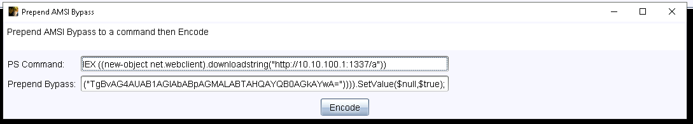
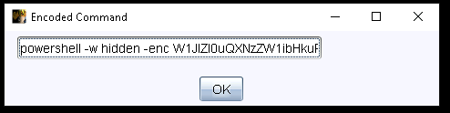
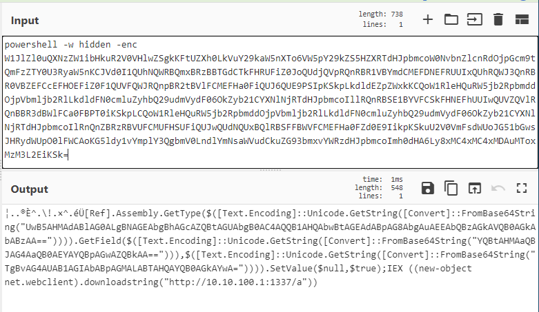

# AMSI Bypass Prepend

Simple tool to quickly prepend a bypass to a Powershell command and receive a concatenated and encoded command output.

1. Input a command, and AMSI bypass method (one is prepopulated):

2. Hit Encode and get full command to copy

Final Command:

